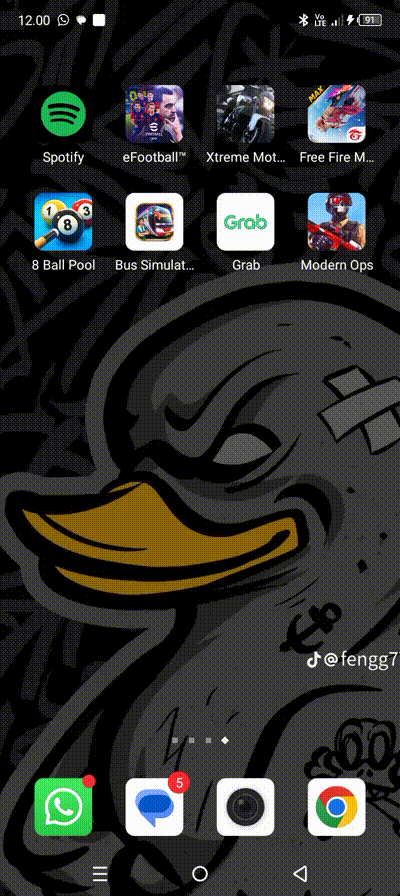

`Nama   : Faizah Via Fadhillah`

`NIM    : 312210460`

`Kelas  : TI.22.A.4`

`Matkul : Pemrograman Mobile 1`


# Launcher Splash

## activity_launcer_splash_logo.xml

```xml
<?xml version="1.0" encoding="utf-8"?>
<RelativeLayout
    xmlns:android="http://schemas.android.com/apk/res/android"
    xmlns:tools="http://schemas.android.com/tools"
    android:layout_width="match_parent"
    android:layout_height="match_parent"
    android:background="#272727"
    tools:content=".MainLauncherSplashLogo">

    <LinearLayout
        android:layout_width="match_parent"
        android:layout_height="wrap_content"
        android:layout_centerInParent="true"
        android:gravity="center"
        android:orientation="vertical">


        <ImageView
            android:id="@+id/imageView"
            android:layout_width="350dp"
            android:layout_height="wrap_content"
            android:adjustViewBounds="true"
            android:src="@drawable/via" />
    </LinearLayout>

</RelativeLayout>
```


## MainLauncherSplashLogo.java

```java
package com.helloappsti22a4;

import android.content.Intent;
import android.os.Bundle;
import android.os.Handler;
import android.view.View;

import androidx.appcompat.app.AppCompatActivity;

public class MainLauncherSplashLogo extends AppCompatActivity {
    @Override
    protected void onCreate(Bundle savedInstanceState){
    super.onCreate(savedInstanceState);
    setContentView(R.layout.activity_launcer_splash_logo);

    View decorView = getWindow().getDecorView();
    // Hide the status bar.
        int uiOptions = View.SYSTEM_UI_FLAG_FULLSCREEN;
        decorView.setSystemUiVisibility(uiOptions);
    // Hide ActionBar
    if (getSupportActionBar() !=null){
        getSupportActionBar().hide();
    }
    new Handler().postDelayed(new Runnable() {
    @Override
        public void run(){
        startActivity(new Intent(MainLauncherSplashLogo.this, MainHomePage.class));
        finish();
    }
    }, 3000);
    }
}

```


# Ekplicit Intent dan Implicit Intent

## activity_home.xml

 ```xml
<?xml version="1.0" encoding="utf-8"?>
<LinearLayout xmlns:android="http://schemas.android.com/apk/res/android"
    xmlns:tools="http://schemas.android.com/tools"
    android:layout_width="match_parent"
    android:layout_height="match_parent"
    android:layout_marginStart="0dp"
    android:layout_marginEnd="0dp"
    android:background="#272727"
    android:gravity="center_vertical"
    android:orientation="vertical"
    tools:context=".MainLauncherSplashLogo">

    <Button
        android:id="@+id/btnHello"
        android:layout_width="match_parent"
        android:layout_height="wrap_content"
        android:layout_marginStart="50dp"
        android:layout_marginEnd="50dp"
        android:text="@string/button_label_toast" />

    <Button
        android:id="@+id/btnCount"
        android:layout_width="match_parent"
        android:layout_height="wrap_content"
        android:layout_marginStart="50dp"
        android:layout_marginEnd="50dp"
        android:text="Project Fibonacci" />

    <Button
        android:id="@+id/btnSianida"
        android:layout_width="match_parent"
        android:layout_height="wrap_content"
        android:layout_marginStart="50dp"
        android:layout_marginEnd="50dp"
        android:text="@string/button_label_pro_sianida" />

    <Button
        android:id="@+id/btnTwoActivity"
        android:layout_width="match_parent"
        android:layout_height="wrap_content"
        android:layout_marginStart="50dp"
        android:layout_marginEnd="50dp"
        android:text="@string/button_label_pro_two_activity" />

    <Button
        android:id="@+id/btnAlarm"
        android:layout_width="match_parent"
        android:layout_height="wrap_content"
        android:layout_marginStart="50dp"
        android:layout_marginEnd="50dp"
        android:onClick="createAlarm"
        android:text="@string/button_label_pro_set_alarm" />
</LinearLayout>
```


## Main Home Page.java

```java
package com.helloappsti22a4;

import android.content.Intent;
import android.net.Uri;
import android.os.Bundle;
import android.provider.AlarmClock;
import android.view.View;
import android.widget.Button;

import androidx.appcompat.app.AppCompatActivity;

import java.util.ArrayList;

public class MainHomePage extends AppCompatActivity {
    Button btnHello;
    Button btnCount;
    Button btnSianida;
    Button btnTwoActivity;
    Button btnAlarm;

    Button btnMaps;

    @Override
    protected void onCreate(Bundle savedInstanceState) {
        super.onCreate(savedInstanceState);
        setContentView(R.layout.activity_home);

        setLayout();
        setKlik();
    }

    void setLayout() {
        btnHello = findViewById(R.id.btnHello);
        btnCount = findViewById(R.id.btnCount);
        btnSianida = findViewById(R.id.btnSianida);
        btnTwoActivity = findViewById(R.id.btnTwoActivity);
        btnAlarm = findViewById(R.id.btnAlarm);
    }

    public void showMap(Uri geolocation){
        Intent intent = new Intent(Intent.ACTION_VIEW);
        intent.setData(geolocation);
        if (intent.resolveActivity(getPackageManager()) !=null){
            startActivity(intent);
        }
    }
    void setKlik() {
        btnHello.setOnClickListener(new View.OnClickListener() {
            @Override
            public void onClick(View view) {
                Intent intenthello = new Intent(MainHomePage.this, MainHello.class);
                startActivity(intenthello);
            }
        });
        btnCount.setOnClickListener(new View.OnClickListener() {
            @Override
            public void onClick(View view) {
                Intent intentcount = new Intent(MainHomePage.this, MainActivity.class);
                startActivity(intentcount);
            }
        });
        btnSianida.setOnClickListener(new View.OnClickListener() {
            @Override
            public void onClick(View view) {
                Intent intentsianida = new Intent(MainHomePage.this, ScrollingIcecold.class);
                startActivity(intentsianida);
            }
        });
        btnTwoActivity.setOnClickListener(new View.OnClickListener() {
            @Override
            public void onClick(View view) {
                Intent intenttwoactivity = new Intent(MainHomePage.this, MainActivityOne.class);
                startActivity(intenttwoactivity);
            }
        });
        btnAlarm.setOnClickListener(new View.OnClickListener() {
            @Override
            public void onClick(View view) {
                Intent intentalarm= new Intent(MainHomePage.this, AlarmActivity.class);
                startActivity(intentalarm);
            }
        });

    }
}
```


## Output

